<picture>
  <source media="(prefers-color-scheme: dark)" srcset="brand/logo/lockup/gamedirection-lockup-white.png">
  <source media="(prefers-color-scheme: light)" srcset="brand/logo/lockup/gamedirection-lockup-black.png">
  
</picture>

# GameDirection Media Kit

**Authored by GameDirection.** Public brand kit - everything needed to add GameDirection's branding to a website: colors, type, logo files, usage rules, company info, project case studies, and testimonials.

**Live preview:** https://gamedirection.github.io/Media-Kit/

## Usage

Free to use for building or updating any site/material that represents GameDirection or a GameDirection project. See [`LICENSE-ASSETS.md`](LICENSE-ASSETS.md) for the do's/don'ts. Full visual reference: [`brand/guide/index.html`](brand/guide/index.html) (or the live preview link above).

## Logo - Quick Link

For dropping the GameDirection mark into another site/README, use the icon or icon+name lockup directly. These are served live via GitHub Pages so they can be hotlinked:

| Asset | Preview | Direct link |
|---|---|---|
| Icon |  | `https://gamedirection.github.io/Media-Kit/brand/logo/icon/gamedirection-icon.png` |
| Icon + name (black, for light backgrounds) |  | `https://gamedirection.github.io/Media-Kit/brand/logo/lockup/gamedirection-lockup-black.png` |
| Icon + name (white, for dark backgrounds) | 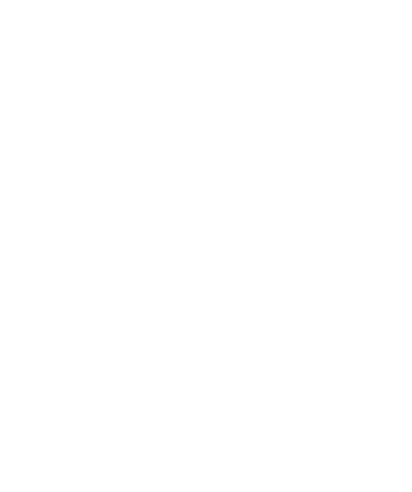 | `https://gamedirection.github.io/Media-Kit/brand/logo/lockup/gamedirection-lockup-white.png` |

Theme-aware embed snippet (auto-switches with the viewer's light/dark mode, same as the top of this README):

```html
<picture>
  <source media="(prefers-color-scheme: dark)" srcset="https://gamedirection.github.io/Media-Kit/brand/logo/lockup/gamedirection-lockup-white.png">
  <source media="(prefers-color-scheme: light)" srcset="https://gamedirection.github.io/Media-Kit/brand/logo/lockup/gamedirection-lockup-black.png">
  
</picture>
```

## Color

Sampled directly from the official logo files (full table: [`brand/colors/palette.md`](brand/colors/palette.md)).

<p>
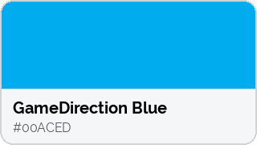
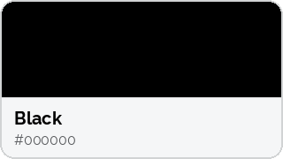
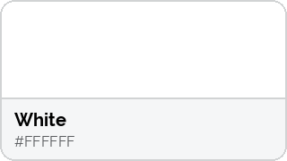
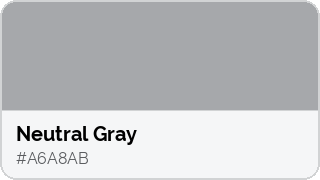
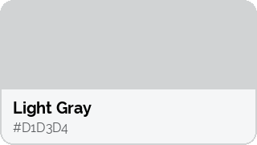
</p>

## Light Mode / Dark Mode

Same UI, both schemes (full interactive version in the [live preview](https://gamedirection.github.io/Media-Kit/)):

<p>
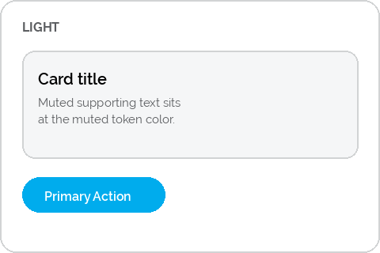
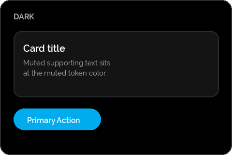
</p>

## Typography

Typeface: **Raleway** (only typeface found in official source material). Full rules and font files: [`brand/typography/typography.md`](brand/typography/typography.md).

## Logo Usage

<p>
 &nbsp;
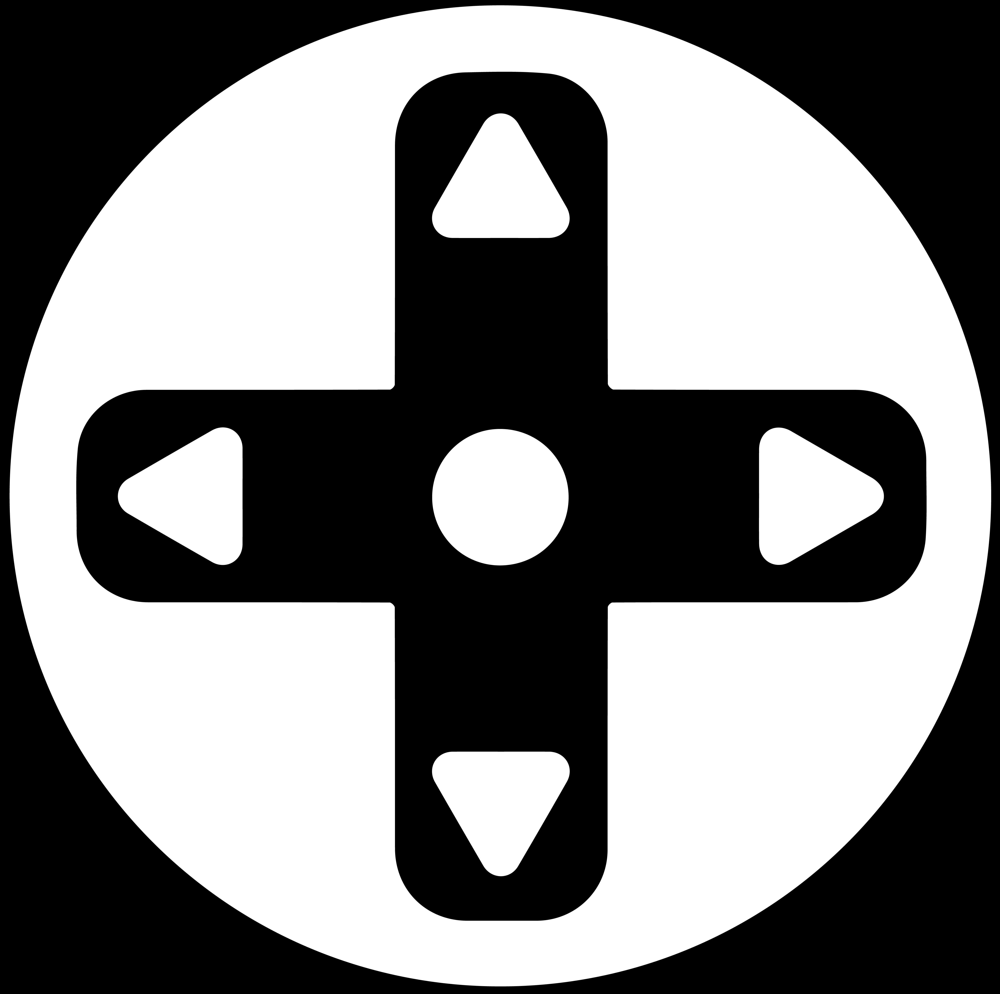 &nbsp;

</p>

Full color &middot; Reverse (on black) &middot; Icon-only

Do/don't, clearspace, and shape-language rules: [`brand/guide/brand-guidelines.md`](brand/guide/brand-guidelines.md).

## Structure

```
brand/
  guide/         visual style guide (index.html) + full written rules (brand-guidelines.md)
  colors/        light + dark mode color tokens + swatch images
  typography/    type rules + Raleway font files
  logo/          primary, reverse, icon/favicon, lockup (icon+name), and motif logo assets
company/
  about.md       who GameDirection is, mission, focus
  team.md        team photos/roles
  testimonials.md
projects/        one folder per project (modular - copy _template/ to add a new one)
assets/          background graphic + press banners
```

## Projects

| Project | Preview |
|---|---|
| [Snack Attack](projects/snack-attack/README.md) | 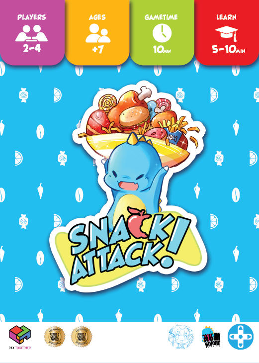 |
| [Emberwind](projects/emberwind/README.md) | 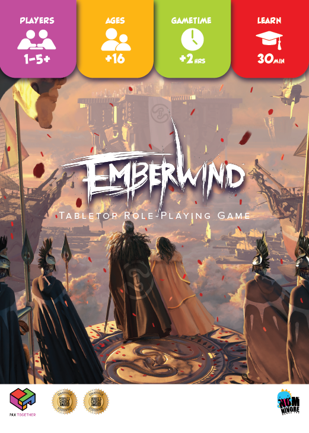 |
| [Exceed](projects/exceed/README.md) | 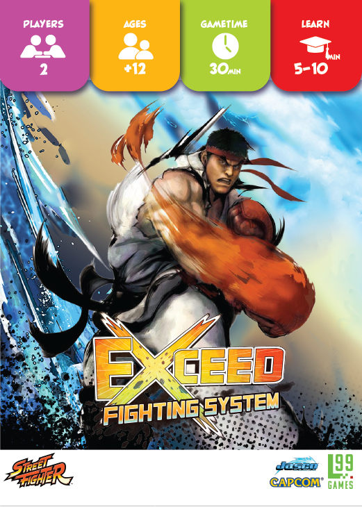 |
| [Dungeons & Dinos](projects/dungeons-and-dinos/README.md) | 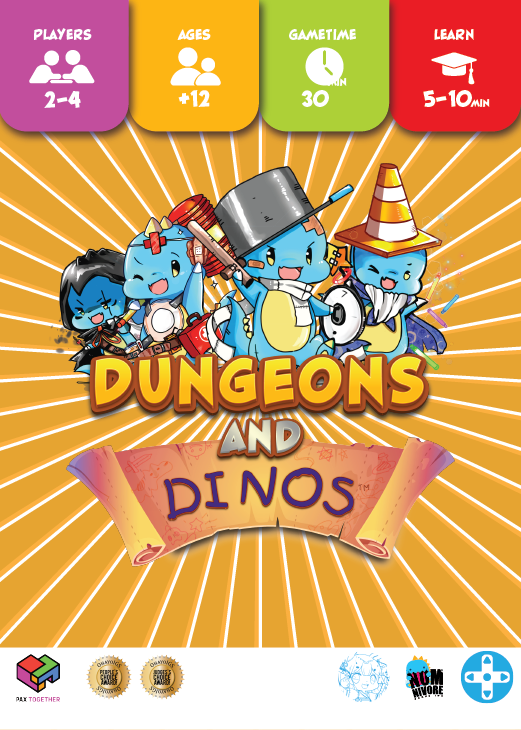 |
| [Project Nightmare](projects/project-nightmare/README.md) | *(no hero art yet)* |

## Adding a New Project

Copy `projects/_template/` to `projects/<project-slug>/`, fill in the README, drop in a `hero.png`. That's the whole process - this repo is set up to grow.
